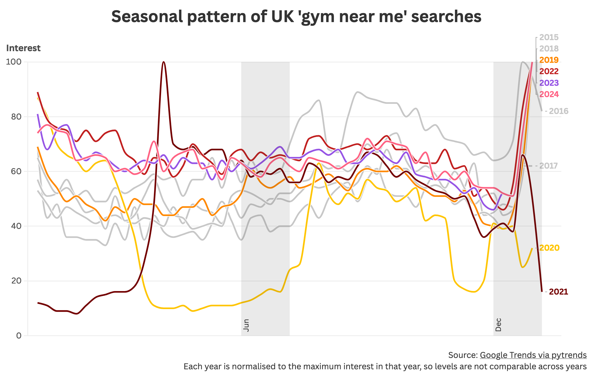

# Paul Barber's github.io

* [linkedin](https://www.linkedin.com/in/pauljbarber/)
* [bluesky](https://bsky.app/profile/pbarber.github.io)
* [github](https://github.com/pbarber)
* [buymeacoffee](https://buymeacoffee.com/pbarber)

## Things I've made

Most recent first:

* [Map Creator App](https://pbarber.github.io/map-creator-app/)
* [NI Isochrones App](https://pbarber.github.io/ni-travel-app/)
* [Map of the Rivers and Lakes of Ireland](https://github.com/pbarber/river-maps/blob/master/README.md)
* [NI COVID-19 data Twitter/X bot](https://twitter.com/ni_covid19_data)

## Sea level changes

I wanted to see whether I could identify sea level rises from open datasets. The British Oceanographic Data Centre hosts readings from the [UK tide gauge network](https://www.bodc.ac.uk/data/hosted_data_systems/sea_level/uk_tide_gauge_network/). I chose the [gauge at Newlyn, Cornwall](https://ntslf.org/tides/uk-network/portinfo?port=Newlyn), as it has the longest, almost continuous record with data going back to 1915. I would have liked to have used the [Bangor station, in NI](https://ntslf.org/tides/uk-network/portinfo?port=Bangor), but the data after early 2016 is flagged as unreliable.

Whichever way I look at the Newlyn data, it is clear that sea levels have been rising over the last 110 years:

* the annual maximum (highest sea level each year) has increased by 30-40cm
* the average daily level has increased by 25-30cm

<noscript></noscript>

Looking at the data by decade, average sea level increased by 28 cm from the 1910s to the 2020s.

<noscript></noscript>

I also produced a model of the typical sea level for each decade, this shows that each decade since the 1980s has had higher sea levels than any previous decade in the dataset.

<noscript></noscript>

## New year, new me

A quick [New Year visualisation](https://public.flourish.studio/visualisation/21031951/) of Google search trends for 'gym near me' shows, unsurprisingly, that the New Year week is the most popular time of year for people looking for a gym in the UK. The only exception is 2021 when the peak was delayed until lockdown ended.

Data extracted from [Google Trends](https://trends.google.com/trends/explore?date=all&q=gym%20near%20me) using [pytrends](https://github.com/GeneralMills/pytrends). Visualised with [Flourish](https://public.flourish.studio/visualisation/21031951/).

## How not to fix a thing

I like fixing things, be they real or software. I recently pulled a pair of guitar pedals out from under a bed and attempted to fix them. In the end I sold one, a [Carlsbro Echo](https://www.dirk-hendrik.com/carlsbro.html), for spare parts and managed to fix the other, a [Jim Dunlop GCB-95 Crybaby Wah](https://www.jimdunlop.com/cry-baby-standard-wah/).

The story of the Crybaby Wah fix goes as follows:

1. The pedal didn't work
2. I diagnosed the problem as a broken 3-pin foot switch
3. I fitted a replacement foot switch but the pedal still didn't work
4. I spent many hours checking the circuit and resoldering suspect joints
5. I then spent more hours staring at circuit diagrams, becoming increasing confused before
6. I eventually realised the online circuits didn't match my version of the pedal (Rev F)
7. I then spent many more hours drawing out the entire circuit using the excellent [Falstad circuit simulator](https://www.falstad.com/circuit/)
8. After creating a full online model of the circuit I realised that I had wired up the foot switch incorrectly
9. I rewired the foot switch and the pedal worked

At point 7 above I felt like I had made an excellent decision to draw out the circuit. I've been in similar situations before, where the best approach is to spend time creating a model so that I have something reliable to compare against. However, attempting to apply good process after the fact sent me off down the wrong path.

I made an incredibly basic mistake much earlier on: at point 3 I should have taken my time. I rushed through the replacement without making any notes, assumed the switch was correctly wired and then wasted many hours due to that incorrect assumption.

So in summary I should have:

1. Made good notes and not rushed
2. Reviewed my previous work once I realised I had been rushing

Anyway, if anyone is ever in need of a relatively well tested model of a Rev F GCB-95 Crybaby Wah pedal, you can find it on [Falstad circuit simulator](https://www.falstad.com/circuit/circuitjs.html?ctz=CQAgjCAMB0l5YCsA2ATI8NV1QdlwMyQAcqyAnObiIpDTXYgKYC0YYAUAOYgAsvxPmGR8BowXUgcAbiALJBvYXIUhsEqHzrlNk6Ig4B3FYuX9TIqQV4gAXkwB2TAE4ty0CJ+i4wvAolRiMHJAsHhUVmo6VFh4OPiSG3dPDls+chElTIy1EjU7Rxc3Dw5ndJF1E1yNMLgObB1EfjUUGmasvihYyFRgyn6BgcFiaFResaoCcmJeKi64CDpOY1mKvKabSqkVsQ7VoUsjNpsO5F46DqkysHlovJvkOiIbJfgjjeqQM7uJI-YZz4PH5QDgAYy+5xaIm+B06YEiIBGYzAE2IkEoyH8OhgCxB1zAAMq-xsz00YzexkoqEBBM2eSuIHIKM+TOppKWaLiRxhlVZn22jJCLOZWyOVLUxEE4tFZXFBGwgupl0wb1lQvlr0lcgVdAUb3O2keckgSXVJvAUAAOgBnMA2li8Ubnci0NEEYT+MY2mD8JTWEjoEK9E0EG21G0AEyYADMAIYAVwANgAXK22+2OhSugTERC4RB5gih60wFD+E2B8vyPxhuCRmMJlPgUqM5mkvnK8lc4zEM7GpJt81ScG9kkBRF9vZqDyDWf9YisdhyaDTHq4chwc6+XtgKKxRZgick81BESkk7QChz2fMFjUR0CNcbyAKIi4MQ4hAggBKIEIFS1XBzUCDQlTgLoMEkCCjn2DoPkuFsPkqJDWj0BYWx5PIeVQ+YEBbUd+yPORxzQvDjBhDoCIQ-EASLERiS0KCpikVN2HkbUllpDjNAgFhEBXJlmLGfhkDY8gXn0dhUH4F0SHkXt2NqEAozjJNk0PMItQ1cAHm4mx4RYQQYnwRAkFwdA82md0XVwg9WNQHJtJuQJuKWEAWAIS981wIIQlMl9pOxfRkEIcy-F4AI0WEHQlJUxt1OuVB5W4lFHJ1PggLecEUWS0kcupYQLmnPpryGBFHUCAtECZHApl9WyQQADx0pdUvAMYMGczppJAABhAAFYsAAoACNE3jJgAEoOGappBBQDAQoIGhVE2GwBuQG1RsTWNQQAa2m5qwmmRF2pcpc1r6-rEC2rhnCYRxDr4PMaCIGgfFe5bLoAKTAfqwAAGlQAHEAB5AZvAAh8AhcAIogELupsX7BoB3g-nlQRkqBbUmshwg5Bi2gdF4JU1HW-rUC2gAHeNnCpxMpr+JK2XNBj2Q0hyzwVVL6KNTYZ1Ksq72XSBcDOYhyH9bAEGIMWGqkI6iAK8dfAIQQkAwS6Bt4LaAE8mETRMAHtDGm4xnMx1nbkIhkLb4LGMZoZlXiyyGXL8ArAguZL9NYTGPFF750DCAlTKC3Fbd03g+3yvg+yeIg6nxdiPZ09jtKWWgpETdrktMgquPznjcLgDHIE9XxsBJ+VrDxNORCLhii4uNHzajmOo+S23mcY3O2XS3hMrqHg7cbx3It0CGSaMsh7Zn4nTu-VAp9Ud0Th8uRd06QQABFOCO4ISR6lFzXle9ToARX3yH-G1TrrAwR2bEEC-l+a4h05cmYz3dbe+vII4p5CJAOUArL4mJXoiG8q9BePVvqoH+gDAgYNuA0CFHmBuQpHgaCkDwcyjBmj4PepYXGolGg6HfDYNAiMrrEC2mNXaB13hyzENgvgvxmqzAgC9BaXwipwIQcDAwPAi4fFEXLSQEMbgAlahFJYJwyYgCNvGZMNN1LNQUBACyiIwgtEUIogAlg4NRW14H9V4E9FEeAVCdSStQeSf9vzg3frXNWy0ZiY17H-XqYQIamUfiTGg6A5ARW8WA0STwlBfB6tYBRggfHX0lBUaqjJwJkFJoIb8NwpG4gcgVBAWibLPxABfMBGQzykEZGiOQuZHG+ByUWbUy0wiD21JkReSApG7mJsgeiBIekL0yQYAAyjos85p-w2wtHGRM1omBklQZM7SSySK40lI-PsEsdDyHPpk4QXS8gPxapjXYp0fFikHEkI07NKTMg6OKBCPZJzKA7KArpBYnadWik7fRezcBSJrhleiRYvrrkccQLpv81aeF8BANWcSQBZK6WCqGzT+lyBYYvABB8wVkE4hLNQEDinfjRordiZBqA3FoGoICdSIVHU5s9SlRBMh8zOQYNuKcsZe3ttSAUscDR9zji8KReKmntVpfKdpmT-kMsgBgJKtikBqDVt4+lEqdDoHooETVKTim9XBubHueVjU6lQQxQVFrQEgk5ay-Sulm7o3dg7FydFcbWBiinfGNxYHk0BrgLa90IxmyqJUBxhUbVCsbj3aOIqR5kBsCgJYCa0F8sjbHJN7U+yZu7tU1OKJqk5pVBSLNiajQFsYEaMBJ8G5+HasoJo0q+oEFFfmBgybam0C+ovFtDQo3MgzWyz88BWkwFEr4EIaAiwLAoPLZsoy7bctymmugMy5kLN3PpFN1SUQx2aJ4eIEF0Q6G-Ewa0BjrTJljA4UETBAHKAfT3N5Rqsblp7tU-lMb1bvskS+6kO7t2SPjXurdMcJHpp5VJdqOQoOfpg2+mDzsOBGx0oIeOWhKD0GHeiMWKBgnRFQ3IZDXxlroedDFUYkFug4eQHhzq+QIEtpQ3Wsjx6sPUaoLRtACr8h1pbUAA) or download [the text file](./gcb-95-rev-f-20240901-1655.circuitjs.txt).

## Google Trends visualised with Flourish

[One for the non-squeamish](https://public.flourish.studio/story/2630542/) living in close proximity to school age children: a rough analysis of the annual peaks in head lice and nits.

I haven't used [Flourish](https://public.flourish.studio/story/2630542/) before, it's a user friendly service for publishing good quality data visualisations with context around them. It would be even better with more support for data wrangling.

[Cursor](https://cursor.com/) wrote the code to pull down the dataset from Google Trends using [pytrends](https://github.com/GeneralMills/pytrends), demonstrating how the combination of web services, open source libraries and AI has changed coding into 'specify and test'.

The code is [here](https://github.com/pbarber/head-lice).

## Isochrones map

These are isochrones, which show how far you can travel from a starting point in a certain time. In this case, in one hour using public transport or walking from four locations in NI. The maps are based on a detailed open dataset that I haven't seen visualised until now.

I've put together [an interactive map](https://pbarber.github.io/ni-travel-app/) so you can explore the dataset for yourself.

If there's a good level of interest I may extend the interactive map to cover all of the UK.

## Ireland's river basins

It's amazing what is possible with less than 300 lines of code, some open data and several open source libraries. I put together this map of the rivers, lakes and streams of Ireland, coloured by river basin. A decade ago, this would only have been possible with months of effort or access to expensive specialised software.

## Code and Numbers

I use this site to archive posts from my old company website at [codeandnumbers.co.uk](codeandnumbers/README.md). Reading them now is a bit like reading my teenage poetry, if I had written any, both highly embarrassing and strangely comforting. The posts, newest first, are:

* [Asking the right questions](codeandnumbers/asking-the-right-questions.md)
* [How to present data for visualisation](codeandnumbers/how-to-present-data-for-visualisation.md)
* [COVID-19, waiting lists and NI hospital beds](codeandnumbers/covid-19-waiting-lists-and-ni-hospital-beds.md)
* [Improving trust in COVID-19 modelling](codeandnumbers/improving-trust-in-covid-19-modelling.md)
* [Data dynamics and COVID-19](codeandnumbers/data-dynamics-and-covid-19.md)
