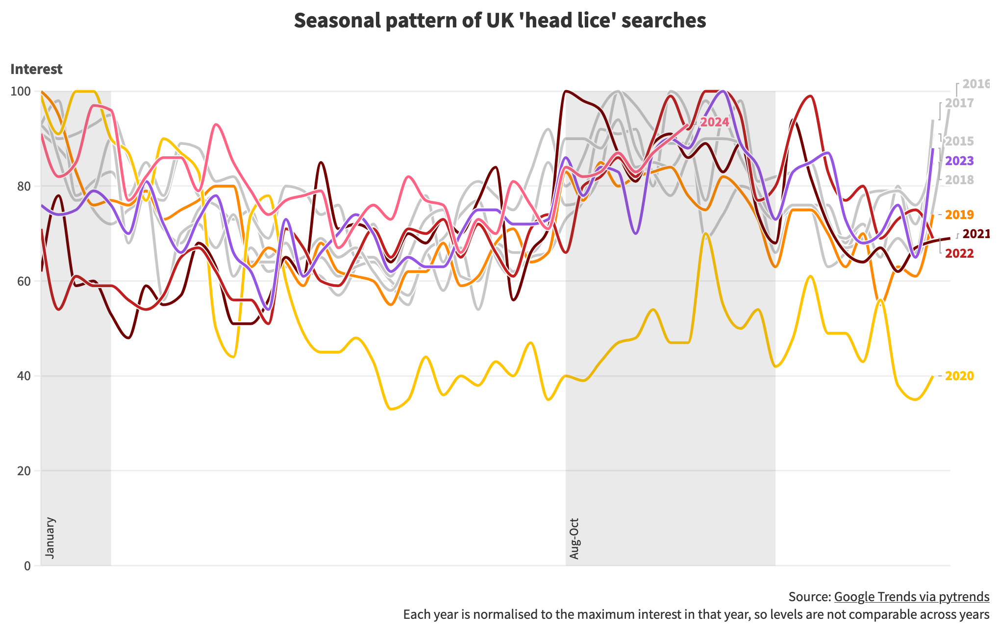
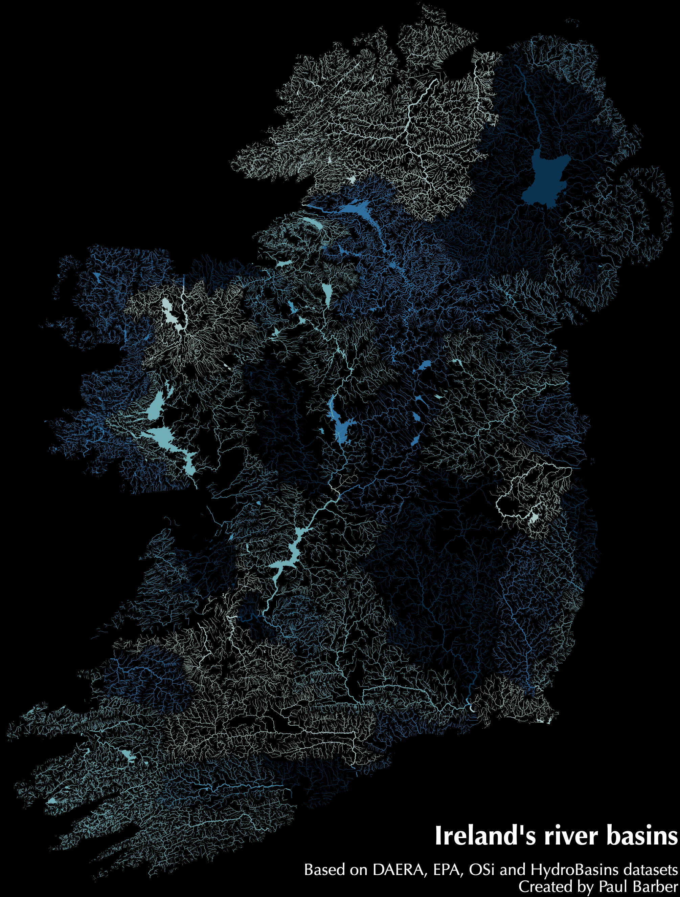

# Paul Barber's github.io

* [linkedin](https://www.linkedin.com/in/pauljbarber/)
* [bluesky](https://bsky.app/profile/paulbarber.bsky.social)
* [github](https://github.com/pbarber)
* [buymeacoffee](https://buymeacoffee.com/pbarber)

## Things I've made

Most recent first:

* [Map Creator App](https://pbarber.github.io/map-creator-app/)
* [NI Isochrones App](https://pbarber.github.io/ni-travel-app/)
* [Map of the Rivers and Lakes of Ireland](https://github.com/pbarber/river-maps/blob/master/README.md)
* [NI COVID-19 data Twitter/X bot](https://twitter.com/ni_covid19_data)

## Google Trends visualised with Flourish

[One for the non-squeamish](https://public.flourish.studio/story/2630542/) living in close proximity to school age children: a rough analysis of the annual peaks in head lice and nits.

I haven't used [Flourish](https://public.flourish.studio/story/2630542/) before, it's a user friendly service for publishing good quality data visualisations with context around them. It would be even better with more support for data wrangling.

[Cursor](https://cursor.com/) wrote the code to pull down the dataset from Google Trends using [pytrends](https://github.com/GeneralMills/pytrends), demonstrating how the combination of web services, open source libraries and AI has changed coding into 'specify and test'.

The code is [here](https://github.com/pbarber/head-lice).

## Isochrones map

These are isochrones, which show how far you can travel from a starting point in a certain time. In this case, in one hour using public transport or walking from four locations in NI. The maps are based on a detailed open dataset that I haven't seen visualised until now.

I've put together [an interactive map](https://pbarber.github.io/ni-travel-app/) so you can explore the dataset for yourself.

If there's a good level of interest I may extend the interactive map to cover all of the UK.

## Ireland's river basins

It's amazing what is possible with less than 300 lines of code, some open data and several open source libraries. I put together this map of the rivers, lakes and streams of Ireland, coloured by river basin. A decade ago, this would only have been possible with months of effort or access to expensive specialised software.

## Code and Numbers

I use this site to archive posts from my old company website at [codeandnumbers.co.uk](codeandnumbers/README.md). Reading them now is a bit like reading my teenage poetry, if I had written any, both highly embarrassing and strangely comforting. The posts, newest first, are:

* [Asking the right questions](codeandnumbers/asking-the-right-questions.md)
* [How to present data for visualisation](codeandnumbers/how-to-present-data-for-visualisation.md)
* [COVID-19, waiting lists and NI hospital beds](codeandnumbers/covid-19-waiting-lists-and-ni-hospital-beds.md)
* [Improving trust in COVID-19 modelling](codeandnumbers/improving-trust-in-covid-19-modelling.md)
* [Data dynamics and COVID-19](codeandnumbers/data-dynamics-and-covid-19.md)
