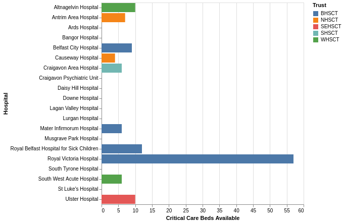
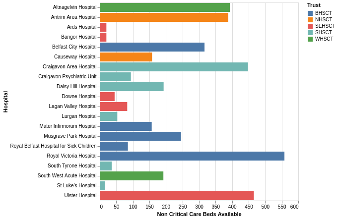
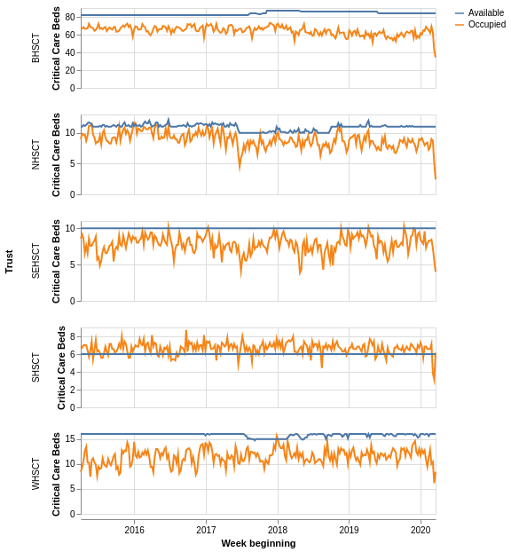
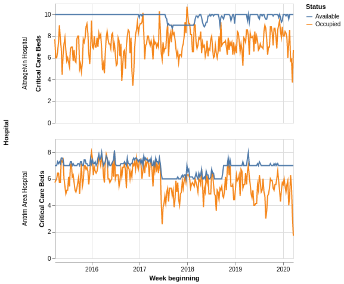
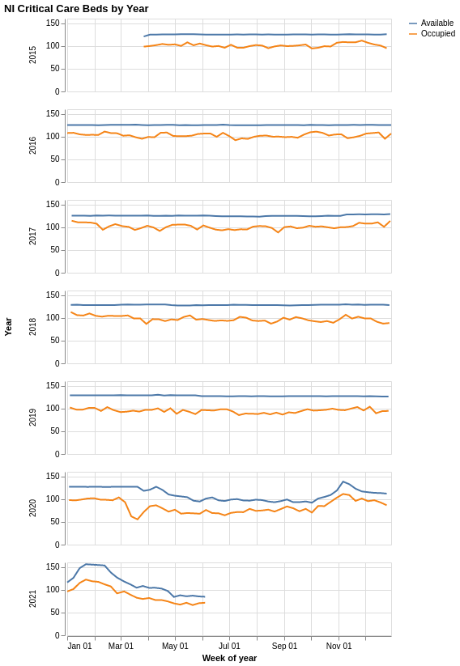
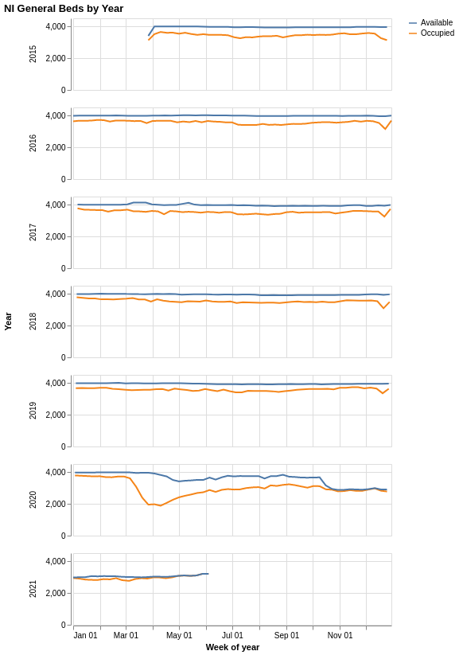
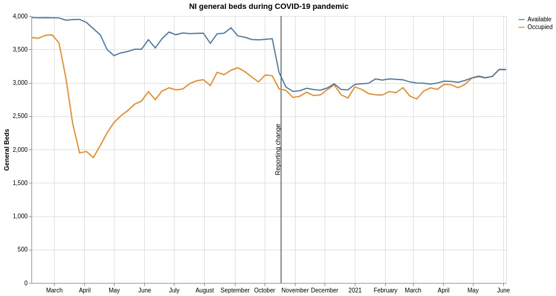
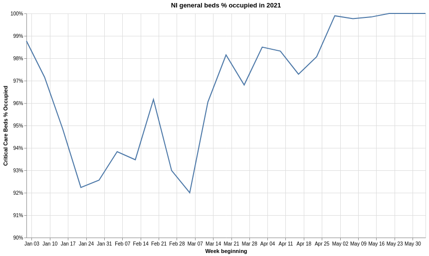

# COVID-19, waiting lists and NI hospital beds

*This post was originally published on codeandnumbers.co.uk on 22nd June 2021*

Inspired by John Burn-Murdoch's [work on hospital admissions and beds in England](https://twitter.com/jburnmurdoch/status/1347200811303055364?lang=en) during the winter wave of the pandemic, I wanted to do the same for Northern Ireland (NI). The Department of Health's (DoH) [daily data publication](https://www.health-ni.gov.uk/topics/doh-statistics-and-research/covid-19-statistics) includes both ICU and general beds data for NI. This data, however, only goes as far back as 1st April 2020, so whilst it is great for monitoring the progression of the pandemic, it doesn't let us compare the last 15 months to a 'normal' year.

I decided that this comparison would be potentially useful, so decided to submit a [Freedom of Information](https://www.gov.uk/make-a-freedom-of-information-request) (FOI) request. I always find this decision tricky, **for each FOI there's a cost to the organisation that receives the request**; it's highly likely that someone will have to compile the data for the response and there is always the chance that the data won't turn out to be interesting. In NI the cost is high as the FOI request needs to be made to each of the 5 Health and Social Care (HSC) Trusts.

To make FOI requests, I use this [very helpful template](https://www.foi.directory/foi-request-template/), and try to make sure that I am as **specific and clear as possible**. Responses are supposed to take 20 working days but most of the trusts are [taking longer](https://www.northerntrust.hscni.net/freedom-of-information/) due to the pandemic. All five responses to my requests were received within 40 working days. 

_Technical notes_: If you are interested in the technical details of combining the six Excel spreadsheets that I received, please take a look at the [script on github](https://github.com/pbarber/ni-covid-tweets/blob/master/notebooks/beds.py). The FOI data was combined with the DoH daily COVID-19 data download and aggregated by week to produce the plots in this article.

## Background

Analysis of beds data usually splits the beds into two categories:

* [Critical care](https://www.kingsfund.org.uk/publications/critical-care-services-nhs) beds: where patients who are critically ill and require constant monitoring are treated
* General beds: where patients' needs can be met through a 'normal' level of hospital care

Critical care beds require a great deal more people and resources:

* the cost of a critical care bed is [around](https://www.wales.nhs.uk/documents/Delivery-Plan-for-the-critically-ill.pdf) two to four and a half times the cost of a general bed,
* there will [normally](https://www.nhs.uk/conditions/intensive-care/) be one critical care nurse for every one or two patients,
* but there are a lot fewer critical care beds than general beds.

In the years before COVID-19, NI reported around 4000 general beds were available, and 120 critical care beds - around 3% of NI's beds are critical care beds. The number of critical care beds available in a typical pre-COVID week (the first full week of 2020) are shown below, by hospital and coloured by trust. Just under half of NI's critical care beds are located in one hospital, and over 75% within the Belfast Trust (BHSCT):

The general beds for the same week are more widely spread:

Hospital beds data has two key metrics: the number of **beds available** on a given day, and the number of those **beds occupied** in the same day. Making more beds available requires more nursing and support staff to take care of the people in those beds as well as more equipment.

The non-Belfast trusts run their small numbers of critical care beds much closer to capacity; **Southern Trust (SHSCT) consistently reported that it was over capacity**.

Hospitals are able to flex their critical care capacity, as shown below at Antrim Area Hospital, but this must take a toll on staff. The chart below also shows an over-capacity week at the end of 2017 at Altnagelvin, possibly associated with a [flu outbreak](https://www.bbc.co.uk/news/uk-northern-ireland-foyle-west-42501930).

## Critical care beds

The most recent data from the Department of Health is not broken down by hospital or trust, so we can only examine all-NI trends. Starting with the critical care beds, we see static capacity with some variation in demand from 2015 to early 2020, then a **lot more variability as the health care system has to cope with the pandemic**.

The above suggests that **COVID forced NI hospitals to be much more flexible with the allocation of critical care beds**, but bear in mind that the comparison may be unfair because:

* the pre-COVID data comes from a different source to the COVID data, so may be reported differently, and that 
* increased scrutiny of the day-to-day situation in critical care may have changed how the data was reported.

What is clear from the data is that in January 2021 the number of people in critical care exceeded any pre-COVID critical care occupancy, but **there was never a time when critical care beds across NI were full**.

## General beds

The pre-COVID general beds capacity is relatively static, with dips in occupancy at Christmas, Easter and the summer holidays. Again COVID creates a lot more variability in the system.

There's an additional complicating factor: the **general beds calculation method changed in October 2020**. The total available beds in NI appears to drop from around 4,000 to around 3,000, occupied beds stays at a similar level. I haven't been able to find a description of the change in this calculation that I understand so can only assume that either:

1. The process of allocating beds changed and the calculations needed to change to reflect the new process
2. A more accurate calculation was put in place

The change in the calculation results in the reported percentage of beds occupied being much higher.

The first wave of the pandemic saw the majority of planned hospital activity cancelled, resulting in a [large drop in occupied beds](https://www.itv.com/news/utv/2021-06-02/exclusive-105m-spent-on-staffed-but-unused-hospital-beds-in-ni). As cases reduced and the lockdown eased, capacity began to be taken up albeit at a lower level than before the pandemic.

## Out of the frying pan...

The biggest challenge for NI's healthcare system now lies ahead, the Department of Health recently [announced £700m of funding](https://www.health-ni.gov.uk/news/minister-unveils-ps700m-plan-tackling-waiting-lists) to tackle the appalling waiting lists which have [built up over the last decade](https://factcheckni.org/articles/northern-ireland-outpatient-waiting-lists-100-times-more-than-englands/) and was exacerbated by the pandemic.

There have recently been reports of over-capacity in NI [emergency departments](https://twitter.com/setrust/status/1404446084177539077?s=20), not caused by COVID, that may well indicate that capacity is being squeezed in an attempt to recover waiting lists. According to the DoH data, **NI's general beds have been fully occupied for the last two weeks**. Being outside looking in, without comparable historical data, it looks as though capacity is very close to the limit.

## In conclusion

I end this analysis with a sense of guilt at spending staff time, in a creaking healthcare system in a pandemic, on FOI requests that do no more than provide a little context to the openly available data. The most interesting point, today's general beds capacity, was visible through the open data. I also feel that my analysis has been limited by a lack of subject matter expertise.

Hopefully DoH will continue to regularly publish the same level of data on hospital capacity - **high quality open data is needed to understand the pressures on our healthcare system whether or not there is a pandemic in progress**.

To try to get the most possible value from the FOI requests, I have published the [cleaned dataset](https://pbarber.github.io/all-foi-weekly.csv) in the hope that others may find it useful.