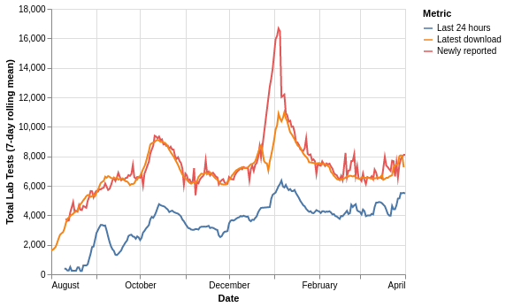
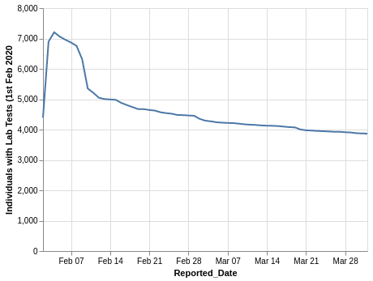
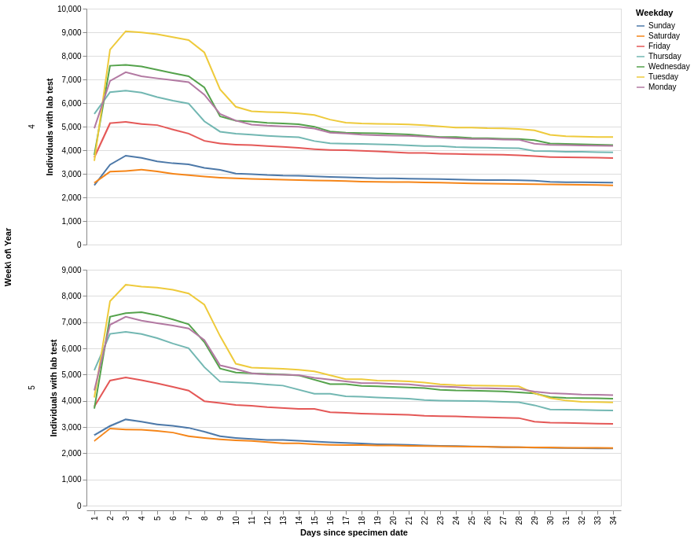
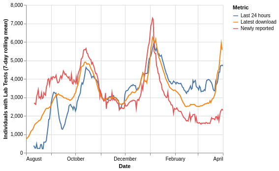
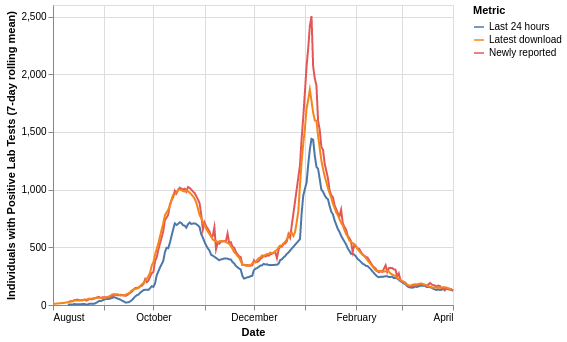
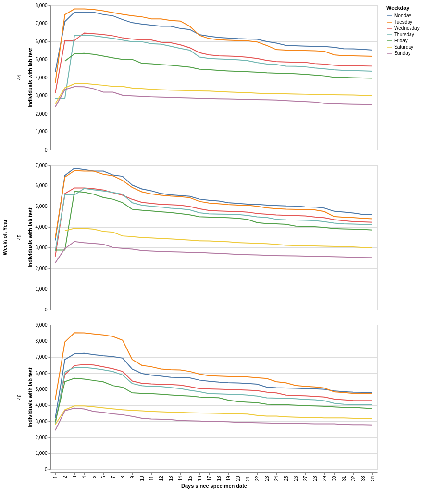
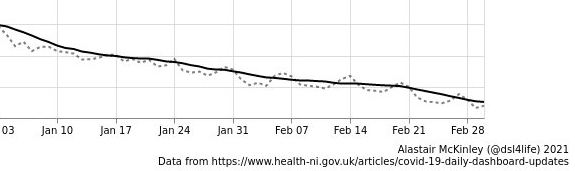

# Data dynamics and COVID-19

*This post was originally published on codeandnumbers.co.uk on 19th April 2021*

I recently set up a [bot](https://twitter.com/ni_covid19_data) to tweet out summaries of regularly published COVID-19 official statistics for Northern Ireland (NI) including:

* daily updates on [vaccinations](https://twitter.com/ni_covid19_data/status/1379410662745604098)
* daily updates on [tests](https://twitter.com/ni_covid19_data/status/1377611469068599299) and cases
* weekly [R number estimate](https://twitter.com/ni_covid19_data/status/1377727106713591808) updates
* weekly [deaths](https://twitter.com/ni_covid19_data/status/1377992820942893057) updates

If you are interested in the technical details, please take a look at the [github](https://github.com/pbarber/ni-covid-tweets).

The whole enterprise has been a great exercise in what I would call **data dynamics**, how the visibility of regular changes in the data can provide greater understanding of the subject matter. This is where I feel data can provide the greatest value, when it is informing your actions on a weekly or daily basis.

**Most of the numbers are fairly simple.** Every day the [HSCNI dashboard](https://covid-19.hscni.net/) is updated with two key pieces of data - the total number of first and second doses administered since vaccinations began. If you know how many adults there are in Northern Ireland then you can work out the proportion of the population that has/hasn't been vaccinated. If you know the totals published yesterday then you know how many vaccinations have been recorded since yesterday. And if you keep a record of how many vaccinations were reported each day then you can produce some [lovely graphs](https://twitter.com/peterdonaghy/status/1379456480294883331) of [progress over time](https://twitter.com/ni_covid19_data/status/1380536222867714051).

**Tests and cases data is not simple.** Until I started working on the bot I thought it was. In order to build the dataset for the graphs in this article, I wrote a [script](https://github.com/pbarber/ni-covid-tweets/blob/master/sam/tests-cleaner/app.py) that downloads and merges together all of the [daily data publications](https://www.health-ni.gov.uk/publications/daily-dashboard-updates-covid-19-april-2021) from the Department of Health (DoH). These files have been published since 31st July 2020.

Every day (or at least every day that DoH provides a data download) the bot will tweet out the number of tests on individuals carried out the preceding day, and the number of those which were positives (aka cases). Taking the ratio of cases to tests gives a number called the **positivity rate**, which is a good barometer of the level of cases within the population, as well as the how well the testing system is covering the pandemic.

But, there's a problem. Data on cases typically moves faster through healthcare data processes than data on tests. Put simply, **healthcare systems care more about positive tests than negative ones**, so negative ones can afford to wait around for a day or two whereas positive tests need to be actioned as soon as possible to prevent further transmission.  There's a very detailed look into this at [The COVID Tracking Project](https://covidtracking.com/analysis-updates/silent-data-mismatches-are-compromising-key-covid-19-indicators) which concludes that positivity rate is one of the best measures we have but should only be used as a rough indicator of the trajectory of the pandemic.

So, let's take a look at the NI data. Data needs to be prepared to fit the way that it is to be used, so I should make my/the bot's needs clear:

1. Provide the best possible representation of yesterday's number and ratio of tests and cases.
2. Allow comparison of yesterday's/this week's positivity rate against older data.
3. Use a consistent and easy to understand approach to meet needs 1 and 2.

I discovered fairly early that to meet these needs, I need to look beyond just pulling and presenting the daily data for NI. This isn't the fault of the data that is provided, **it wasn't designed to meet my needs**. There are two reasons:

1. Case data travels faster than negative test data, so **it can take a few days before the numbers reflect all the tests that happened on a particular day**. Some of the data is therefore delayed. If I have a test today, if it is positive it will probably be included in tomorrow's data download but may otherwise take 2-3 days to be counted.
2. The data was designed to keep track of the total number of people that have had a test and their most recent test and positive test - many people will have more than one test and a few unfortunate people will have multiple positive tests. So, the DoH data **only includes the most recent test and case information for each person**. If I had a test in September 2020 and another in March 2021, then my September test will have been removed from the DoH September tests count once the March one was added. If I tested positive in March, this was recorded for March and any prior positive test would also have been removed from the DoH data.

These two reasons interact in a fairly unpleasant way, from my perspective, but let's deal with one at a time. Along the way we will discover another reason why the data is tricky for me to deal with.

## Data delays

The data delays mean that yesterday's case and test numbers are always under reported, as data on many of the tests and a smaller proportion of the cases are still travelling through the healthcare system, to be published tomorrow or in the following days. 

The chart below shows how the number of tests carried out varies depending on how you extract the data. Note that this chart shows the number of swabs that were tested and does not include any removal of individuals following further tests. This chart is plotted using the 7-day rolling average in order to clean up daily variation.

The metrics are:

* **Last 24 hours**: the number of swabs in each day's download with a specimen/testing date 1 day before the download - this is what the bot is currently using
* **Newly reported**: the difference in number of swabs between a day and the day before's downloads
* **Latest download**: the number of swabs reported for each specimen/testing date in the most recent DoH data download - 1st April 2021 at time of writing

The chart clearly shows that due to data delays **the last 24 hours method is under reporting the number of swabs**, the other two metrics track well other than what could be some significant data corrections during the ramp-up phase of the most recent peak in late December.

## Most recent data

Use of only a person's most recent test and case data means that **as time passes the total number of tests and cases will decline** as people are retested. This makes calculating older positivity rates from the current data confusing and incorrect; I want to know what the positivity rate was in September, not what it was for only the people who haven't had a test since then.

This effect can be seen in the data with a specimen date of 1st February 2021. Bear in mind that a fixed but currently unknown number of people were tested on the day in question, the chart only shows how that number has been reported over time in the daily downloads:

It took 3-4 days for the reports to reach a peak, then there is an immediate decline, with marked drops at 1 week, 2 weeks and 1 month following the test date. The variation in the number of tests per day makes it tricky to visualise the whole data set, but patterns become clearer if we look at a week at a time, in this case, the fourth and fifth weeks of 2021:

A couple of key trends are present:

* the early week days have the most tests, weekends have the fewest
* the fast ramp up to the maximum within 2 or 3 days of the specimen date is a result of the data delays discussed above
* week days show a sharp decline from the 7th to the 8th day, as people are retested, weekends have a more gradual decline

From this, I infer that the regular asymptomatic testing of [primary care](https://www.nidirect.gov.uk/articles/coronavirus-covid-19-testing-and-contact-tracing) and [care/nursing home staff](https://www.publichealth.hscni.net/covid-19-coronavirus/testing-and-tracing-covid-19/testing-covid-19/covid-19-regular-programme-covid) is a substantial contributor to the total number of tests, and responsible for the sharp decline at 7 days. Care/nursing home residents are retested every 28 days. We'll come back to this in a little while.

What effect does the removal of older tests have on the testing figures? We know from the data delays investigation that taking **the last 24 hours of data results in significant under-reporting** of the true number of tests, but for most of the year to date, **the last 24 hours gives the largest number** (blue line). This gives a good indication of the scale of the effect of the removal of older tests - this is large.

This chart is plotted using the 7-day rolling average in order to clean up daily variation.

It's hard not to take detours in this analysis, so here's another one. The red line above is the number of newly reported individuals each day, i.e. the total number of people who have never previously had a test. This is the number that the DoH dashboard leads with, as well as [many](https://www.bbc.co.uk/news/uk-northern-ireland-56693156) [of](https://www.bbc.co.uk/news/uk-northern-ireland-56659129) the BBC reports. This is not 'how many people were tested on day X' but 'how many people who have never previously been tested were tested yesterday, and their tests have made it through the system in under 24 hours'.

**NI's approach to counting tests and cases is different to England's**. [England counts all tests](https://coronavirus.data.gov.uk/details/testing) but only a person's first positive test is included in the case numbers. NI counts only the most recent test and case for a person. This means that the two nations' historical positivity rates cannot be directly compared.

Hopefully by now it is clear that using the DoH daily data in the context of daily tests and cases updates is complicated and confusing. To round out the charts, here is the rolling average of the individuals tested positive - as before, taking the data just for the last 24 hours (blue) consistently under reports cases. The effect of the removal of older cases slightly reduces the latest download (orange) compared to the original reports - fewer people are testing positive more than once than are taking multiple tests.

## Reason for a test

Taking a step back to the impact of regular care-related testing on the data, people taking a test are either:

* **symptomatic**: they have a symptom of COVID-19
* **asymptomatic**: they have no symptoms but are getting the test because they would be at high risk of passing on or contracting the virus due to their job/travel/other reasons

The likelihood of a test being positive is much higher if the person has symptoms, so positivity rates will be different between the symptomatic and asymptomatic testing.

The graphs for early November 2020 (weeks 44-46) show when weekly testing became more apparent in the data:

I estimate that there are around 7,000 people having weekly asymptomatic tests in NI. This will be having an influence (downwards) on overall positivity rates (the ratio of cases to tests), and is, I believe, **the reason for the 'weekly wave'** that has been [identified by Alastair McKinley](https://twitter.com/dsl4life/status/1367124747939688451), positivity is higher on weekends as far less asymptomatic testing is carried out on Saturday and Sunday. The dotted line is the 'raw' positivity rate and the black line is the 7-day rolling average.

The underlying reason for having a test is, as you would expect, influencing the data that we are seeing. As cases hopefully continue to decline, symptomatic tests will decline and the current level of regular asymptomatic testing will have a proportionally larger influence on the data. Add to this the adoption of wider workplace/educational/travel testing and the roll-out of LFD (lateral flow device) testing; **as time passes the tests/cases data is going to become harder to interpret**. If we can separate the factors influencing the data then we can better understand the data.

## Let's try to conclude something

Using the daily data as it stands for daily reporting is pretty flawed, newest data is under reported and some of the older data is removed. In an ideal world, three things would change:

1. Tests and cases would be made available with and without removal of people's earlier tests
2. Tests and cases would be reported separately based on the reason for the tests
3. Standardised reporting of tests and cases across regions/nations

Before writing this, I put a request to the DoH dashboard team for point 1, and am currently awaiting a response. I only really began to understand the influence of the reasons for testing on the data whilst writing the article.

I believe that it is possible to create an indicative, approximate metric for point 1 from the existing data, but if the DoH can provide this data, it will be accurate. I will update this post, and the [bot](https://twitter.com/ni_covid19_data) once the path forward is clear.

The third point is much bigger than a bot with 49 followers, this pandemic isn't over yet and there may well be others within our lifetime. We do need to take a step back while we have the time and agree on standardised ways to present pandemic data, I hope this is already happening. Find the best in class approaches, promote them and drive usage across the world.

Thanks very much for reading and please let me know your thoughts, I make a lot of assumptions here and corrections would be welcomed.